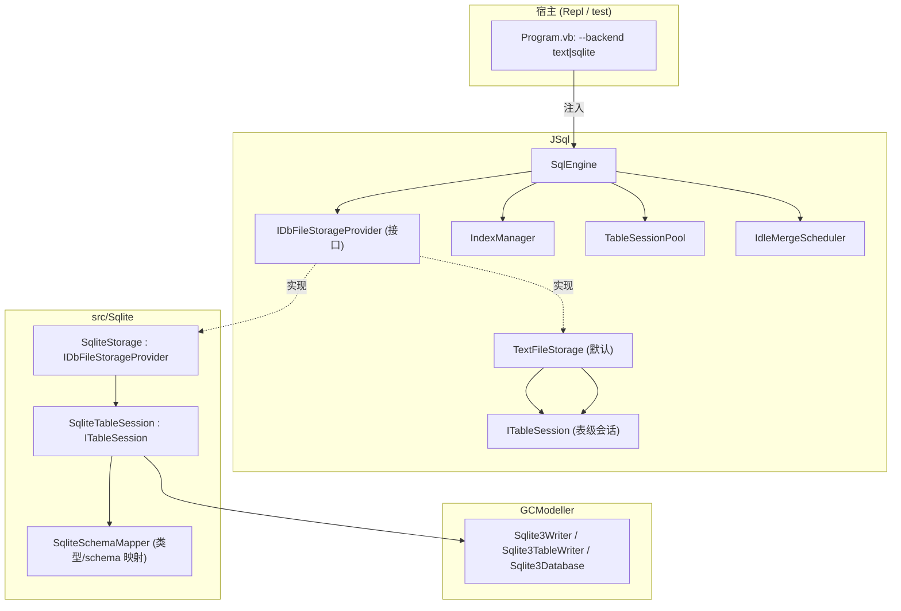

## 产品概述

在 JSql 实验性 SQL 引擎中新增一套以 **SQLite 数据库文件**为物理载体的数据库文件引擎，并把引擎的存储层重构为**可插拔的存储后端抽象**，使 JSql 能在「文本文件后端（JSONL / CSV）」与「SQLite 文件后端」之间自由切换。一个 JSql 数据库对应一个 `.sqlite` 文件（内含该库的所有表），仍保留"一个数据库 = 一组表"的 SQL 语义。

## 核心功能

- **存储后端抽象**：定义 `IDbFileStorageProvider` 接口，统一描述一个数据库后端的目录/文件管理、库级与表级操作、表会话获取、加载/保存/删除表、存储诊断与释放等能力。
- **文本后端**：将现有 `DatabaseCatalog`（目录式 `*.schema.json` + `*.jsonl` / `*.csv` + WAL）重构为 `TextFileStorage`，实现 `IDbFileStorageProvider`，行为与文件布局保持完全不变。
- **SQLite 后端**：新增 `SqliteStorage`（实现 `IDbFileStorageProvider`），基于托管 SQLite3 读写引擎持久化：**每个数据库一个 `.sqlite` 文件**，多张表共存于同一文件；建库/删库、建表/删表、行级读写、模式重建、库内表枚举、存储诊断均可用；SQLite 文件可被外部工具直接打开读取表数据。
- **引擎面向接口**：`SqlEngine` 内部通过 `IDbFileStorageProvider` 存取数据，并**暴露 provider 类型的设置函数**，开发者传入 `TextFileStorage` 或 `SqliteStorage` 实例即可切换物理文件引擎。
- **宿主注入**：REPL 宿主新增后端选择启动开关（如 `--backend text|sqlite`），在构造引擎时注入对应 provider；解决 `Sqlite` 与 `Repl`/`JSql` 的程序集引用方向，避免循环引用。
- **功能全量保留与验证**：现有 JSONL/CSV 后端、列索引 `*.idx`、`SHOW STORAGE`、`CHECKPOINT`、WAL、demo/stress 测试继续可用；新增 SQLite 后端端到端测试（DDL/DML/SELECT/重开持久化/存储诊断）。

## 技术栈

- 语言/运行时：VB.NET + .NET 10（沿用现有工程）
- 存储后端 A：现有文本行式引擎 `TextLineStore` + WAL + `IRowCodec`（JSONL/CSV），复用不改动
- 存储后端 B：托管 SQLite3（`G:\GCModeller\...\SQLite3\SQLite3.vbproj`，程序集 `Microsoft.VisualBasic.Data.IO.SQLite3`，根命名空间 `Microsoft.VisualBasic.Data.IO.ManagedSqlite`），通过 `Sqlite3Writer` / `Sqlite3TableWriter` / `Sqlite3Database` 直接读写 SQLite 文件格式
- 索引：沿用 `IndexManager` + `IndexPersistence`（内存索引构建，落盘 `.indexes/*.idx`），与物理后端解耦
- 测试宿主：现有 `test` 控制台工程（demo/stress/all 分发）

## 实现方案

### 总体策略

在 `JSql` 中引入**数据库级**抽象 `IDbFileStorageProvider`（现有 `ITableSession` 是表级会话，继续保留并复用）。`DatabaseCatalog` 更名为 `TextFileStorage` 并实现该接口（默认后端）；`SqlEngine` 只依赖接口，并提供 provider 设置函数完成注入/切换。`src/Sqlite` 侧新增 `SqliteStorage`（实现同一接口）与 `SqliteTableSession`（实现 `ITableSession`），桥接托管 SQLite3 引擎。宿主通过显式依赖注入选择后端，既满足"插件化"诉求，又完全避免 `JSql → Sqlite` 的反向引用（`Sqlite → JSql` 保持单向）。

### 关键决策与权衡

1. **数据库级 provider 而非表级**：用户确定"一库一 `.sqlite` 文件"，故抽象必须位于数据库层（`ITableSession` 仅作为库内单表句柄），据此 `DatabaseCatalog` 的上层调用点几乎零语义变化。
2. **接口形状与 `DatabaseCatalog` 现有公开面 1:1 对齐**：`IDbFileStorageProvider` 覆盖 Root / Options / CurrentDatabase / Sessions / DatabaseExists / GetDatabases / CreateDatabase / DropDatabase / DatabaseDir / TableExists / GetTables / IsLegacyTable / FindTableFile / OpenSession / TryGetSession / LoadTable / SaveTable / DeleteTable / DescribeStorage / Dispose。这样 `SqlEngine.Catalog` 属性类型改为接口后，`SqlExecutor` 与现有测试（`engine.Catalog.TryGetSession/DatabaseDir/LoadTable/DescribeStorage/GetTables`）**无需改动即可编译通过**，`Catalog` 保留为 `DataStore` 的只读别名以满足向后兼容。
3. **注入方式**：`SqlEngine` 新增 `Public Property DataStore As IDbFileStorageProvider`（setter 内做旧 provider 释放 + `IndexManager`/`TableSessionPool`/`IdleMergeScheduler` 重建），并保留 `Catalog` 兼容别名；构造重载 `New(root, options)` 默认构造 `TextFileStorage`。
4. **复用 `TableSessionPool`**：该池与格式无关（以 `dbDir/table` 为键、工厂委托创建会话、统一 Merge/Dispose），`SqliteStorage` 直接复用，避免重造缓存/合并/关闭逻辑（DRY）。
5. **模式元数据落盘**：SQLite DDL 无法承载 JSql 的 `COMMENT` / `DEFAULT` / 表级 `UNIQUE KEY`/`KEY`。因此 SQLite 后端仍以 `SchemaStore` 的 `<table>.schema.json` 作为模式的权威来源（保存于该库的辅助目录），SQLite 文件仅承载列与行数据，并同时按映射后的列建立 SQLite 表，保证外部工具可读。
6. **SQLite 后端辅助目录**：数据库文件为 `<root>\<db>.sqlite`；其辅助目录（存放 `<table>.schema.json` 与 `.indexes/`）为 `<root>\.jsql\<db>\`。`DatabaseDir(db) `返回该辅助目录，从而 `SchemaStore`、`IndexPersistence`、`SHOW STORAGE` 全部可原样复用；`GetDatabases()` 只枚举 `*.sqlite` 文件，避免与文本后端的库目录互相污染。
7. **类型映射（往返一致）**：`INT→INTEGER`、`DOUBLE→FLOAT`、`VARCHAR→TEXT`、`BOOLEAN→BOOLEAN`、`DATE/DATETIME→TEXT`（**刻意用 TEXT 而非 DATETIME**：托管引擎的 `DataTypeParser` 把 `datetime` 归为 Integer 亲和性，可能触发数值转换破坏日期字符串）。读取时统一用 `SqlTypes.CoerceValue` 归一为 JSql 规范类型（Long/Double/String/Boolean）。
8. **外部 SQLite 文件容错**：打开无 `<table>.schema.json` 的库时，退回从 `Sqlite3SchemaRow.ParseSchema()` 的 DDL 反解 `TableSchema`（列名 + 声明类型映射），`COMMENT/默认值/键` 置空，保证可读。
9. **性能与一致性**：托管 SQLite 写入引擎为"整库内存模型 + Commit 时整文件重建（临时文件 + 原子替换）"。因此 `SqliteTableSession.SyncRows` 只更新内存模型（纯追加走 `AddRow` 快路径，否则 `Clear + AddAll`），**仅在 `Merge`/`Flush`/`Dispose`/idle checkpoint 时 Commit**，避免每条语句都重写整库；读路径 `ReadRows` 直接从内存表枚举，保证"写完即读"。复杂度：LoadTable O(全表)，SyncRows O(变化行) 至 O(全表)，Merge O(整库字节)。已知约束（整库需驻留内存、无二级索引）在文档中如实说明。

### 架构设计



数据流：`SQL 文本 → Parser → Executor → DataStore(IDbFileStorageProvider)`。

- 文本后端：`SaveTable → OpenSession → TextTableSession.SyncRows → TextLineStore(WAL) → idle/CHECKPOINT Merge`。
- SQLite 后端：`SaveTable → OpenSession → SqliteTableSession.SaveSchema(schema.json) + SyncRows(内存模型) → Merge/CHECKPOINT → Sqlite3Writer.Commit()（整库重写）`。

## 关键实现要点

- **单向后端选择**：同一 `SqlEngine` 实例同一时间只持有一个 provider；文本与 SQLite 布局互不识别对方（各自文件夹/文件命名），切换后端即切换 `DataStore`。
- **SqliteStorage 的 writer 生命周期**：每个数据库持有一个 `Sqlite3Writer`（按 db 缓存），多张表的 `SqliteTableSession` 共享该 writer；任一表的 `Merge()` 触发 `writer.Commit()`；库内最后一个会话关闭或 provider 释放时 `Commit + Dispose`。`DropDatabase` 先关闭该库全部会话再删文件与辅助目录。
- **SqliteTableSession 字段映射**：`Layout="SQLITE"`、`DataFilePath=<db>.sqlite`、`SchemaFilePath=<aux>\<table>.schema.json`、`LogFilePath=""`、`LineCount=表行数`、`PendingOperations=脏标记数`、`WalFileSize=0`、`DataFileSize=.sqlite 文件大小`、`HasPendingChanges=writer.IsDirty`。
- **DDL 生成**：`CreateTable` 使用 `Sqlite3Column(name, mappedType, notNull, primaryKey)`；`INTEGER PRIMARY KEY` 由托管引擎按 rowid 别名处理，主键值可正确往返。表结构（列集合）变化时先 `DropTable` 再 `CreateTable`。
- **错误处理与资源**：所有文件/引擎异常向上抛出为可读消息，shutdown 路径（`Dispose`/`Commit`）失败不得中断进程；沿用现有 `Event Info` 诊断通道，`--verbose` 输出。
- **兼容性**：不改动 JSONL/CSV 的文件名、格式识别、WAL、索引与 `SHOW STORAGE` 语义；`StorageFormat` 枚举保持 `{Jsonl, Csv}`（后端选择与行格式互相正交）。
- **工程引用修正**：移除 `Sqlite.vbproj` 对 `Repl.vbproj` 的引用（Exe 宿主不应被库项目依赖）；`Repl.vbproj`、`test.vbproj` 增加对 `Sqlite.vbproj` 的引用用于注入与测试；`JSql.vbproj` 不新增对 `Sqlite` 的引用，保持无环。

## 目录结构

```
g:\JSql\
├── src\JSql\
│   ├── Storage\
│   │   ├── IDbFileStorageProvider.vb   # [NEW] 存储后端抽象接口（数据库级）：库/表目录与文件管理、会话获取、Load/Save/DeleteTable、DescribeStorage、Dispose、ProviderName/Root/Options/CurrentDatabase/Sessions
│   │   ├── TextFileStorage.vb          # [NEW] 由 DatabaseCatalog 更名；实现 IDbFileStorageProvider，封装现有目录式 jsonl/csv + WAL 逻辑，行为与文件布局完全不变
│   │   └── DatabaseCatalog.vb          # [REMOVE] 逻辑迁移到 TextFileStorage.vb（可选保留同名薄别名类以兼容旧引用）
│   ├── Engine\
│   │   ├── SqlEngine.vb                 # [MODIFY] 依赖 IDbFileStorageProvider；默认 TextFileStorage；新增 DataStore 属性(可设) + 设置函数 + Catalog 兼容别名；setter 重建 IndexManager/Pool/CheckpointScheduler
│   │   └── Executor.vb                  # [MODIFY] 仅当签名受接口影响时调整（Catalog 属性类型改为接口后多数调用不变）
│   └── Indexing\
│       └── IndexManager.vb              # [MODIFY] 构造函数改收 IDbFileStorageProvider；继续用 DatabaseDir(db) 定位 .indexes
├── src\Sqlite\
│   ├── Sqlite.vbproj                    # [MODIFY] 移除对 Repl.vbproj 的引用（保留对 JSql.vbproj / SQLite3.vbproj 等的引用）
│   ├── SqliteStorage.vb                 # [NEW] 实现 IDbFileStorageProvider：一库一 <db>.sqlite；writer 缓存与 Commit 生命周期；会话池；辅助目录 .jsql\<db>\；DescribeStorage
│   ├── SqliteTableSession.vb            # [NEW] 实现 ITableSession：ReadRows/SyncRows/SaveSchema/Flush/Merge/Dispose，桥接 Sqlite3TableWriter，含追加快路径
│   ├── SqliteSchemaMapper.vb            # [NEW] JSql 规范类型 ↔ SQLite 声明类型映射；TableSchema ↔ Sqlite3Column；DDL→TableSchema 反解；行值往返归一
│   └── SQLiteTableStore.vb              # [MODIFY] 现为空类；移除或改造为底层 helper（避免遗留空类）
├── src\Repl\
│   ├── Program.vb                       # [MODIFY] 新增 --backend text|sqlite（别名 --engine）；构造 SqlEngine 后注入 New SqliteStorage(root, options)；更新 banner/help
│   └── Repl.vbproj                      # [MODIFY] 新增对 Sqlite.vbproj 的 ProjectReference
├── test\
│   ├── test.vbproj                      # [MODIFY] 新增对 Sqlite.vbproj 的 ProjectReference
│   ├── Program.vb                       # [MODIFY] 新增 sqlite 测试模式分发
│   └── StorageSqliteTests.vb            # [NEW] SQLite 后端端到端回归：建库建表/增删改查/SHOW STORAGE/CHECKPOINT/重开持久化/外部可读
└── README.md                            # [MODIFY] 补充 SQLite 后端说明、--backend 开关、一库一文件布局与已知限制
```

## 关键代码结构

```
Namespace Storage
    ''' <summary>数据库文件存储后端抽象：一个实现代表一种物理存储引擎，管理整库的目录/文件、表会话与读写。</summary>
    Public Interface IDbFileStorageProvider : Inherits IDisposable
        ReadOnly Property ProviderName As String        ' "text" / "sqlite"
        ReadOnly Property Root As String
        ReadOnly Property Options As StorageOptions
        ReadOnly Property Sessions As TableSessionPool
        Property CurrentDatabase As String

        Function DatabaseExists(name As String) As Boolean
        Function GetDatabases() As List(Of String)
        Sub CreateDatabase(name As String)
        Sub DropDatabase(name As String)
        Function DatabaseDir(db As String) As String

        Function TableExists(db As String, table As String) As Boolean
        Function GetTables(db As String) As List(Of String)
        Function IsLegacyTable(db As String, table As String) As Boolean
        Function FindTableFile(db As String, table As String) As String

        Function OpenSession(db As String, table As String) As ITableSession
        Function TryGetSession(db As String, table As String) As ITableSession

        Function LoadTable(db As String, table As String) As StoredTable
        Sub SaveTable(db As String, table As StoredTable)
        Sub DeleteTable(db As String, table As String)

        Function DescribeStorage(db As String) As List(Of Object())
    End Interface
End Namespace
```

（表级会话继续复用现有 `ITableSession`，SQLite 侧只需实现 `ReadRows`/`SyncRows`/`SaveSchema`/`Flush`/`Merge`/`Dispose` 与统计属性，接口定义已在前述文件中确认，无需新增表级抽象。）

## Agent Extensions

### SubAgent

- **code-explorer**
- Purpose: 在执行重构前，精确核对 `SqlEngine` / `SqlExecutor` / `IndexManager` / `DatabaseCatalog` 的所有调用点与 `Sqlite3Writer`/`Sqlite3TableWriter` 的确切成员签名（含类型与返回值），降低接口替换的遗漏风险。
- Expected outcome: 产出调用点清单与确切的 SQLite3 API 签名核对结果，确保 `IDbFileStorageProvider` 成员完整、宿主注入代码可直接编译。

### Skill

- **lsp-code-analysis**
- Purpose: 对 `DatabaseCatalog`、`engine.Catalog` 做引用/实现/调用层次分析，定位所有需随接口类型变更同步修改的位置（含测试工程），并对更名后的 `TextFileStorage` 做影响面验证。
- Expected outcome: 完整的引用与实现清单，保证重构后无残留旧类型引用、无编译错误，且现有 demo/stress 测试保持通过。