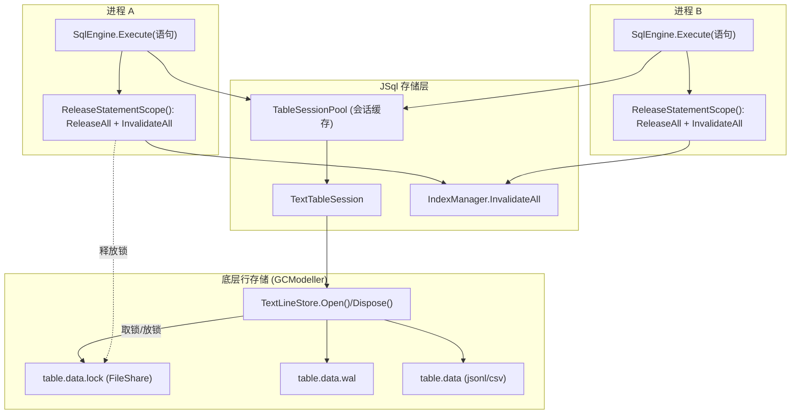

## 产品概述

为 JSql 的 **JSONL / CSV 文本后端**增加多进程访问能力：不再要求「一个数据库被单一进程独占整个生命周期」，而是让多个进程可以**交替**在同一个数据库上执行 SQL 语句——每个语句结束时释放表级文件锁，其它进程即可取得锁执行自己的语句。

## 核心功能

- **语句级锁生命周期**：锁只在单条 SQL 语句执行期间持有（取锁 → 加载表 → 内存修改 → 保存 → 重建索引 → 释放锁），语句之间不持锁，因此多个进程可交替推进；同一张表任一时刻仍只有一个写者，单条语句对同一张表保持原子性。
- **底层锁模式可配置**：行存储引擎的配置项新增锁模式（独占 / 共享读 / 不加锁）与锁等待参数；独占模式仍是默认值，未开启新特性时行为与现在完全一致。
- **冲突处理可选**：默认「等待并重试，超时后报明确错误」，并提供开关切换为「立即失败并报错」。
- **索引缓存一致性**：释放锁时同步失效查询索引的内存缓存，避免另一进程修改数据后候选集漏行导致的错误结果。
- **只读元数据不取锁**：`DESCRIBE` 等仅读取表结构的语句不再取得表锁，避免无谓的跨进程等待。
- **兼容性**：新增能力默认关闭；关闭时单进程语义与性能保持不变；WAL 崩溃恢复语义不变。

## 边界说明

- 本次只覆盖文本后端（JSONL / CSV）。`--legacy-json` 单文件整表布局与 SQLite 后端不在本次范围内，文档中标注其仍不支持多进程。
- 不提供多写并发与冲突检测（采用"交替 + 单表单写者"模型）；跨多表语句在极端加锁顺序下可能发生互等，通过等待超时降级为可读错误而非永久挂起。

## 技术栈

- 语言 / 运行时：VB.NET + .NET 10（沿用现有工程，无新增第三方依赖）。
- 存储引擎（可改，另一个仓库）：`g:/GCModeller/.../Microsoft.VisualBasic.Core/src/Data/Repository/TextStore/`（`TextLineStore.vb`、`TextStoreOptions.vb`、`WAL.vb`）。
- JSql 侧：`src/JSql/Storage`（`StorageOptions`、`TableSessionPool`、`TextFileStorage`、`TextTableSession`、`IDbFileStorageProvider`）、`src/JSql/Engine`（`SqlEngine`、`Executor`）、`src/JSql/Indexing`（`IndexManager`）、`src/Repl/Program.vb`、`test`。

## 实现方案

### 总体策略

采用**语句级锁租约**：保留底层"独占锁 + WAL 崩溃恢复"的模型不变，只把"持锁时长"从"进程生命周期"缩短为"单条语句"。JSql 引擎在每条语句结束（`finally`）时把会话池中所有表会话合并并关闭（释放文件锁），下一条语句重新打开会话时会重新取锁并从磁盘读取最新状态（含重放 WAL），因此能看到其它进程已提交的修改。

### 关键决策与权衡

1. **锁模式放在底层引擎、由 JSql 映射**：用户已授权修改 `TextLineStore`。在 `TextStoreOptions` 增加 `LockMode`（`Exclusive` 默认 / `SharedRead` 共享读 / `None` 不加锁）与 `LockWaitTimeoutMs`、`LockRetryIntervalMs`。默认值（`Exclusive` + 超时 0）与当前行为逐位一致，保证 GCModeller 其它使用方不受影响。
2. **默认关闭、开关启用**：新增 `StorageOptions.MultiProcessAccess`（默认 `False`）。关闭时不调用语句级释放、后台空闲合并照常运行，单进程性能与语义完全不变；开启时才启用语句级释放并停用后台空闲合并（后台调度器只要持有会话就会一直持锁，故必须停用）。
3. **释放即合并，控制 WAL 增长**：`TableSessionPool` 增加 `ReleaseAll(merge:=True)`（复用现有 `DisposeAll` 的"有待合并修改则先 Merge 再 Dispose"逻辑）。释放时合并可让磁盘始终接近最新状态、避免下一条语句重放越来越长的 WAL；纯追加走快路径（O(新增字节)），更新/删除触发整文件重写（较大开销）。提供 `MergeOnStatementEnd` 开关供写入吞吐优先的场景关闭（代价是 WAL 增长与重放开销）。
4. **释放即失效索引缓存**：`IndexManager` 的 `indexSets`/`builtObjects`/`builtRowCount` 是跨语句缓存，另一进程改数据后会过期并可能使候选集**漏行**。新增 `InvalidateAll()`，在语句级释放时清空，使 `.idx` 归档在下次使用时从磁盘重新加载。`.idx` 的写入发生在持锁语句内，因此写本身已被串行化。
5. **无锁读元数据**：`IDbFileStorageProvider` 增加 `LoadSchema(db, table) As TableSchema`。`TextFileStorage` 直接从 `<table>.schema.json`（或 legacy 文件）读取，不创建/打开会话；`SqliteStorage` 读辅助目录 schema 文件（缺失时回退 `LoadTable(...).Schema`）。`Executor` 的 `DESCRIBE`/`SHOW COLUMNS` 分支改用它，避免为看列定义而取表锁。
6. **不引入跨进程锁服务**：不新增独立的锁文件/守护进程，只复用底层 `.lock` 的 `FileShare` 语义，进程崩溃时由 OS 自动释放句柄。

### 性能与可靠性

- 语句级打开/关闭的固定成本：重新打开数据文件句柄 + 读取稀疏 `.idx` + 重放（通常为空的）WAL + 合并。纯追加合并为 O(新增字节)；更新/删除为 O(表字节)。该成本仅在多进程模式开启时产生。
- 单条语句内"取锁→读→改→写→重建索引"全程持锁，因此不会出现跨语句的丢失更新；下一条语句重新取锁并重新读取最新数据。
- 崩溃恢复完全沿用底层（WAL 记录 + 合并标记 + `.bak` + 撕裂尾回滚）；`WAL.Dispose()` 不删除 `.wal` 文件，未合并记录会在下次打开时重放，这是"释放锁不丢数据"的前提。
- 死锁（一条语句涉及多表且两进程加锁顺序相反）通过等待超时降级为明确错误；可选加固为语句开始时按表名排序预取锁（本次列为可选，不默认实现）。

### 架构设计



数据流：`SQL 文本 → Parser → Executor → DataStore(TextFileStorage) → TableSessionPool → TextTableSession → TextLineStore(取锁) → 语句结束释放锁`。

## 目录结构

```
g:\GCModeller\src\runtime\sciBASIC#\Microsoft.VisualBasic.Core\src\Data\Repository\TextStore\
├── TextStoreOptions.vb        # [MODIFY] 新增 TextStoreLockMode 枚举与 LockMode/LockWaitTimeoutMs/LockRetryIntervalMs（默认值保持现状）
└── TextLineStore.vb           # [MODIFY] Open() 改为 AcquireLock()：按锁模式打开 .lock，并按超时/间隔重试；超时给出含锁路径的明确错误

g:\JSql\
├── src\JSql\
│   ├── Storage\
│   │   ├── StorageOptions.vb            # [MODIFY] 新增 MultiProcessAccess / LockMode / LockConflictPolicy / LockWaitTimeoutMs / LockRetryIntervalMs / MergeOnStatementEnd，并在 CreateStoreOptions() 中映射
│   │   ├── TableSessionPool.vb          # [MODIFY] 新增 ReleaseAll(merge)（复用 DisposeAll 的合并+释放+清缓存逻辑）
│   │   ├── IDbFileStorageProvider.vb    # [MODIFY] 新增 LoadSchema(db, table) As TableSchema（无锁读表结构）
│   │   └── TextFileStorage.vb           # [MODIFY] 实现 LoadSchema：直接读 <table>.schema.json / legacy，不打开会话
│   ├── Engine\
│   │   ├── SqlEngine.vb                 # [MODIFY] Execute() 的 finally 调用 ReleaseStatementScope()；多进程模式下不启动 IdleMergeScheduler；新增公开 ReleaseStatementScope()
│   │   └── Executor.vb                  # [MODIFY] DESCRIBE / SHOW COLUMNS 分支改用 DataStore.LoadSchema（不再 LoadTable 取锁）
│   └── Indexing\
│       └── IndexManager.vb              # [MODIFY] 新增 InvalidateAll()：清空 indexSets / builtObjects / builtRowCount
├── src\Sqlite\
│   └── SqliteStorage.vb                 # [MODIFY] 实现 LoadSchema（读辅助 schema 文件，缺失时回退 LoadTable）
├── src\Repl\
│   └── Program.vb                       # [MODIFY] 新增 --multiprocess/--share、--lock-fail-fast、--lock-timeout <ms> 解析、banner 与 help
├── test\
│   ├── StorageMultiProcessTests.vb      # [NEW] 多进程回归：锁冲突/等待重试/快速失败、跨进程并发写入后数据完整、索引缓存失效正确性
│   └── Program.vb                       # [MODIFY] 新增 multiprocess 测试模式（并可纳入 all），并支持 worker 子进程插桩
└── README.md                            # [MODIFY] 更新"单进程独占"限制说明、多进程模式用法与剩余限制
```

## 关键代码结构

存储配置新增项（JSql 侧）：

```
Public Enum LockConflictPolicy
    Wait = 0      ' 等待并重试，超时后报错
    FailFast = 1  ' 立即失败并报明确错误
End Enum

Public Class StorageOptions
    ' ...existing...
    Public Property MultiProcessAccess As Boolean = False
    Public Property LockMode As TextStoreLockMode = TextStoreLockMode.Exclusive
    Public Property LockConflictPolicy As LockConflictPolicy = LockConflictPolicy.Wait
    Public Property LockWaitTimeoutMs As Integer = 5000
    Public Property LockRetryIntervalMs As Integer = 50
    Public Property MergeOnStatementEnd As Boolean = True
End Class
```

引擎语句级释放（JSql 侧）：

```
Public Function Execute(statementText As String) As ResultSet
    CheckpointScheduler.EnterBusy()
    Try
        Return ExecuteStatement(New SqlParser(statementText).ParseStatement())
    Finally
        ReleaseStatementScope()
        CheckpointScheduler.ExitBusy()
    End Try
End Function

Public Sub ReleaseStatementScope()
    If Not Storage.MultiProcessAccess Then Return
    Sessions.ReleaseAll(Storage.MergeOnStatementEnd)
    _indexes.InvalidateAll()
    If _scheduler IsNot Nothing Then _scheduler.Touch()
End Sub
```

底层锁获取（GCModeller 侧）：

```
Public Enum TextStoreLockMode
    Exclusive = 0   ' 独占（默认，当前行为）
    SharedRead = 1  ' 共享读：仅限只读使用
    None = 2        ' 不加锁（调用方自行保证互斥）
End Enum
```

注：`SharedRead` / `None` 作为引擎能力提供（供只读消费者与高级场景使用），JSql 多进程模式默认使用 `Exclusive`（因为语句是读-改-写）。

## Agent Extensions

### SubAgent

- **code-explorer**
- Purpose: 在改动底层 `TextLineStore` / `TextStoreOptions` 前，穷举 `g:/GCModeller` 中这两个类型的所有引用点与派生路径假设，确保新增配置项默认值能完全保持既有行为（向后兼容）。
- Expected outcome: 产出 `TextStoreOptions` / `TextLineStore` 的调用点清单与兼容性结论，避免影响 GCModeller 其它使用方。

### Skill

- **lsp-code-analysis**
- Purpose: 对 `StorageOptions`、`TableSessionPool`、`IDbFileStorageProvider`、`SqlEngine` 的签名变更做引用/实现分析，定位所有需要同步修改的位置（含 `TextFileStorage`、`SqliteStorage`、`Executor`、`Repl`、测试工程）。
- Expected outcome: 完整的引用与实现清单，保证重构后无残留旧签名引用、编译通过，且现有 demo/sqlite/stress 测试保持通过。