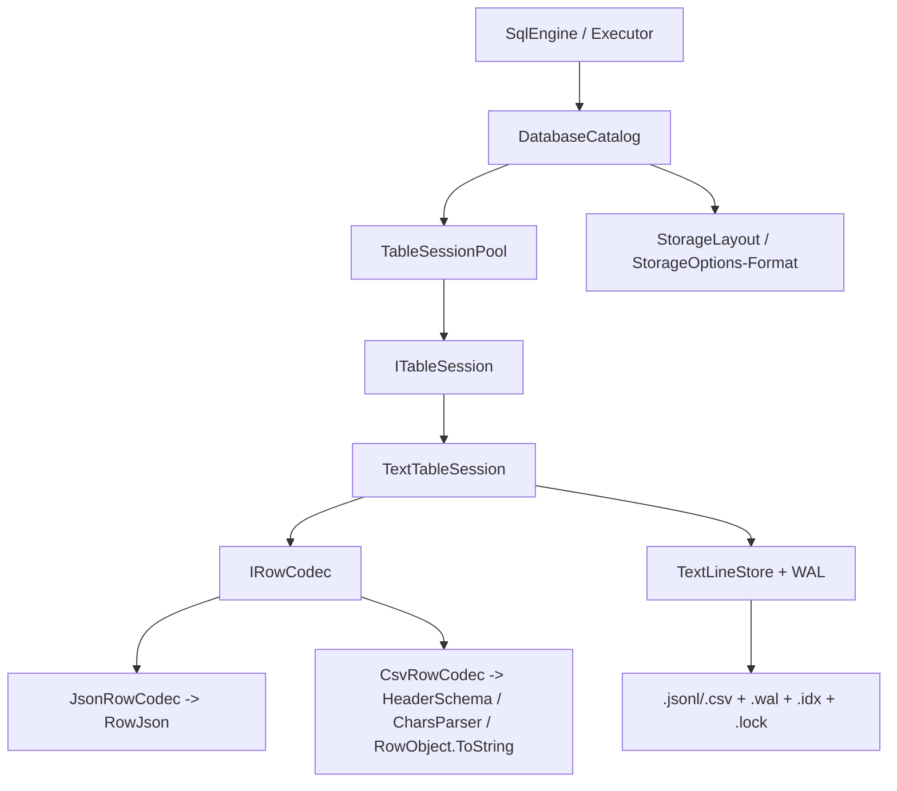

## 产品概述

在现有 JSql（VB.NET 编写、兼容 MySQL 语法的 SQL 引擎；一个文件夹 = 一个数据库，一个文件 = 一张表）基础上，把底层「JSONL 文件 + WAL 日志」存储引擎泛化为**与格式无关的纯文本行存储引擎**，并基于 DataFrame 基础库提供的 CSV API 新增 **CSV 存储格式**，通过配置项在 JSONL 与 CSV 之间切换。完成后在测试工程中补齐功能 demo 与 2GB 级读写压力测试。

## 核心功能

- **底层引擎泛化**：把 `JsonlStore` 重构为格式无关的 `TextLineStore`（行内容不透明、按行切分），保留 `JsonlStore` / `JsonlStoreOptions` 兼容包装；WAL、稀疏行索引、内存片段层、增量合并与崩溃恢复完全复用，行为不变。
- **CSV 表存储**：CSV 文件结构为「表头行 + 数据行」；列类型、NOT NULL、主键/键、注释等元数据仍保存于 `<表>.schema.json`。用 `HeaderSchema` 读取表头列序与映射、用 `Tokenizer.CharsParser` 解析每一行、用 `RowObject.ToString` 生成每一行。
- **格式切换配置**：`StorageOptions` 新增存储格式枚举（Jsonl/Csv），REPL 新增启动开关（`--format csv` / `--storage csv`），控制新建表默认格式。
- **读写一致**：CSV 与 JSONL 共用同一行级 WAL 写入/重放/合并路径，支持 INSERT/UPDATE/DELETE、CHECKPOINT、SHOW STORAGE、退出合并与重开恢复；单元格内 CR/LF 写盘时规范化为空格，保证「一行一条记录」。
- **兼容共存**：已有 JSONL 与旧版单文件 `.json` 表读写不变；同目录内按扩展名自动识别不同格式。
- **测试与压测**：在 `test\test.vbproj` 增加 demo 测试（分别验证 JSONL 与 CSV 全链路）与 2GB 级数据库读写性能压力测试。

## 技术栈

- 语言/运行时：VB.NET / .NET 10（沿用现有工程，不引入新依赖）。
- 底层引擎：泛化 `Microsoft.VisualBasic.Core` 的 `Data.Repository.TextStore`（`JsonlStore` + `WAL` + `BufferedLineReader`）。
- CSV API：`Microsoft.VisualBasic.Data.Framework`（`dataframework-netcore5.vbproj`，RootNamespace=`Microsoft.VisualBasic.Data.Framework`）
- 表头 schema：`StorageProvider.HeaderSchema`（`New(headers)`、`GetOrdinal`/`Headers`，重复表头抛 `DuplicateNameException`）。
- 行解析：`IO.CSVFile.Tokenizer.CharsParser(line, ","c)`。
- 行生成：`IO.RowObject.ToString(content, ",")`（内部 `EscapeCsv`）。
- 工程引用：`JSql`/`Repl`/`test` 均已引用 `Core.vbproj`、`dataframework-netcore5.vbproj`、`LINQ.vbproj`，CSV API 可直接使用。

## 实现方案

### 关键事实（已核实）

`JsonlStore` 实际从不解析 JSON，只按 `0x0A` 切行、维护内存片段表(Piece) + 稀疏行索引(`.idx`) + WAL + 显式 `Merge()`，行内容是「不透明字符串」。因此「格式无关化」本质是**重命名 + 文档泛化**，引擎逻辑零改动；CSV 支持只需替换「行的编解码器」，即可完整复用 WAL / 合并 / 崩溃恢复。

### 关键决策

1. **Core 内重构 + 兼容包装**：新增 `TextLineStore`（可继承）与 `TextStoreOptions`；`JsonlStore : Inherits TextLineStore`、`JsonlStoreOptions : Inherits TextStoreOptions` 作为兼容壳；`WAL` 参数类型改为 `TextStoreOptions`。**保持 `.idx` 魔数 `&H4A4C5349` 不变**，旧数据库索引仍可加载；Core 自带测试 `jsonlStoreTest.vb` 无需改动。
2. **行编解码抽象**：JSql 引入 `IRowCodec`，`JsonRowCodec` 委托现有 `RowJson`（输出字节保持不变）；新增 `CsvRowCodec`。会话泛化为 `TextTableSession`，由 codec + 是否含表头决定具体格式。
3. **CSV 表头处理**：物理第 1 行为表头（schema 列序）；会话仅把「第 1 行之后」的数据区纳入差异同步，插入/替换物理行号偏移 +1，纯追加走 store 末尾。打开已有 CSV 时用 `HeaderSchema` 解析首行做列名映射（支持外部 CSV 列序不同），保存时把表头刷新为 schema 列序。
4. **值序列化**：NULL→空串；BOOLEAN→`1/0`；INT/DOUBLE→InvariantCulture（整数无小数点）；DATE/DATETIME→既有规范串；字符串→原样并**将 CR/LF 替换为空格**；回读经 `SqlTypes.CoerceValue` 按列类型转换，空串→NULL。
5. **格式解析与默认**：`StorageLayout` 新增 `.csv`；`DatabaseCatalog.ResolveLayout` 依次识别 `.csv` → `.jsonl` → 旧 `.json`；仅有 `.schema.json`（尚无数据文件）时按 `Options.Format` 判定。

### 性能与可靠性

- CSV 完整复用稀疏索引（O(1) 随机定位）+ WAL（只记录变更行）+ 增量合并（O(变更量)），15GB 级文件的追加/局部替换仍是增量写，不做整表加载/重写。
- 每行解析用 `CharsParser`（单遍字符扫描，O(行长度)）；表头仅解析一次并缓存 ordinal 映射，避免逐行重复解析（无 N+1）。
- 类型转换/列序映射为每行常数开销，瓶颈仍是磁盘 I/O；合并沿用原子替换 + `.bak` + 撕裂写回滚，崩溃安全语义不变。

### 技术债控制

复用 `ITableSession`、`SqlTypes`、`SchemaStore`、`StorageLayout` 既有模式；`Indexing/*` 作用于内存 `StoredTable.Rows`，**无需改动**。仅把 `TableSessionPool`/`SqlEngine`/`Executor` 从强类型 `JsonlTableSession` 收敛到 `ITableSession`。

## 架构设计

格式无关底层引擎 + 可插拔行编解码 + 会话/目录分派：



## 目录结构

```
g:/GCModeller/src/runtime/sciBASIC#/Microsoft.VisualBasic.Core/src/Data/Repository/TextStore/
├── TextStoreOptions.vb     # [NEW] 格式无关存储配置（由 JsonlStoreOptions 属性迁移，文档泛化）
├── TextLineStore.vb        # [NEW] 格式无关纯文本行存储引擎（由 JsonlStore.vb 泛化；Magic/索引/WAL/合并逻辑不变，允许继承）
├── JsonlStore.vb           # [MODIFY] 兼容包装：JsonlStore : Inherits TextLineStore，构造委托基类
├── JsonlStoreOptions.vb    # [MODIFY] 兼容包装：JsonlStoreOptions : Inherits TextStoreOptions
└── WAL.vb                  # [MODIFY] options 类型由 JsonlStoreOptions 改为 TextStoreOptions（仅类型替换，日志格式不变）

g:/JSql/
├── src/JSql/Storage/
│   ├── IRowCodec.vb          # [NEW] 行编解码抽象：LayoutName / HasHeader / SerializeLine / DeserializeLine
│   ├── JsonRowCodec.vb       # [NEW] JSONL 编解码，委托 RowJson（输出字节不变）
│   ├── CsvRowCodec.vb        # [NEW] CSV 编解码：表头 ordinal 映射 + CR/LF 规范化 + CharsParser + SqlTypes.CoerceValue + HeaderSchema 表头构建/校验
│   ├── TextTableSession.vb   # [NEW] 通用会话：TextLineStore + IRowCodec；ReadRows 跳过表头行；SyncRows 头尾裁剪后偏移 +1；SaveSchema 触发表头刷新
│   ├── JsonlTableSession.vb  # [MODIFY] 收敛为薄封装（JsonRowCodec、无表头、Layout="JSONL"）
│   ├── CsvTableSession.vb    # [NEW] 薄封装（CsvRowCodec、HasHeader=True、Layout="CSV"）
│   ├── StorageLayout.vb      # [MODIFY] 新增 CsvDataExtension=".csv" 与 DataPathForFormat；IsDataFile/TableNameOf/ListTables 识别 .csv
│   ├── StorageOptions.vb     # [MODIFY] 新增 StorageFormat 枚举与 Format 属性；CreateJsonlOptions 泛化为 CreateStoreOptions() As TextStoreOptions
│   ├── TableSessionPool.vb   # [MODIFY] 缓存类型改为 ITableSession；GetOrOpen 改为工厂式（Catalog 传入创建委托）
│   └── DatabaseCatalog.vb    # [MODIFY] TableLayout 增加 Csv；ResolveLayout/OpenSession/SaveTable/LoadTable/DeleteTable/DescribeStorage 支持 CSV 与按 Format 选新表格式
├── src/JSql/Engine/
│   ├── SqlEngine.vb          # [MODIFY] MergeTable/FlushAll 使用 ITableSession
│   └── Executor.vb           # [MODIFY] ExecuteShow 的 Storage 分支使用 ITableSession（Layout 显示 CSV/JSONL/JSON）
├── src/Repl/Program.vb       # [MODIFY] ParseOptions 新增 --format/--storage <jsonl|csv>；更新启动横幅与 PrintHelp
├── test/Program.vb           # [MODIFY] 由 Hello World 改为测试入口，按参数分发 demo / stress 套件
├── test/StorageFormatDemoTests.vb  # [NEW] JSONL / CSV 功能回归 demo
├── test/StorageStressTests.vb      # [NEW] 2GB 级数据库读写压力测试
└── README.md                 # [MODIFY] 补充 CSV 格式说明、文件布局、开关表、代码结构、已知限制
```

## 关键接口契约（节选）

```
' 行编解码器：格式无关的行 <-> 行文本 转换
Public Interface IRowCodec
    ReadOnly Property LayoutName As String      ' "JSONL" / "CSV"
    ReadOnly Property HasHeader As Boolean      ' CSV=True（物理首行为表头），JSONL=False
    Function SerializeLine(row As Dictionary(Of String, Object), schema As TableSchema) As String
    Function DeserializeLine(line As String, schema As TableSchema) As Dictionary(Of String, Object)
End Interface

' 存储格式开关
Public Enum StorageFormat
    Jsonl = 0
    Csv = 1
End Enum
```

## 测试与验收（test\test.vbproj）

`test\test.vbproj`（OutputType=Exe，RootNamespace=`test`，已引用 JSql/Core/DataFrame/LINQ）作为统一测试宿主，`test/Program.vb` 按参数分发；默认无参跑快速 demo。

### 1. 功能 demo 测试（`StorageFormatDemoTests`，快速）

对 **JSONL 与 CSV 两种格式执行同一套用例**，经 `SqlEngine.ExecuteBatch` 端到端断言结果一致：

- DDL/元数据：`CREATE DATABASE/TABLE`、`DESCRIBE`、`SHOW TABLES`、`SHOW STORAGE`（断言 Layout 分别为 `JSONL`/`CSV`）。
- DML：批量 `INSERT`、`SELECT WHERE/ORDER BY/LIMIT`、`UPDATE`、`DELETE`，逐条断言行数与单元格值。
- CSV 专有：物理首行必须是表头且列序与 schema 一致；含逗号/双引号/换行的字段写入后仍能按规范化结果读回；文件行数 == 数据行数 + 1。
- WAL 与恢复：写入后不 checkpoint，`Dispose` 引擎再重开，断言未合并数据经 WAL 重放后完整可见；`CHECKPOINT` 后断言 `.wal` 清空、数据落入数据文件。
- 合并与格式识别：`Merge()` 后用 `TextLineStore.ReadLine` 校验物理行号；同目录内同时放置 JSONL 与 CSV 表，断言 `GetTables`/`LoadTable` 按扩展名各自正确识别读取。

### 2. 压力测试（`StorageStressTests`，可配置规模）

- 目标规模：默认约 **2GB**（`--size <GB>` / `--rows <N>` 可调），行宽接近真实业务（`id INT`、`name VARCHAR(64)`、`payload VARCHAR(200)`、`amount DOUBLE`、`ts DATETIME`）。
- 写入吞吐：分批（如每批 10k 行）`INSERT`，统计行/秒、MB/秒、WAL 增长量与 checkpoint 次数，JSONL 与 CSV 各一轮对比。
- 读取性能：全表顺序扫描（`SELECT COUNT(*)` 与逐行 `ReadRows`）、建索引后等值/范围查询耗时对比。
- 局部改写：对已合并大表执行 `UPDATE`/`DELETE`，统计增量写（WAL 记录数与文件增长）与耗时，验证 O(变更量)。
- checkpoint：分别测「末尾纯追加快路径」与「中间改动全量重写路径」的 `Merge()` 耗时与磁盘占用。
- 磁盘/资源：测试前检查可用磁盘空间（不足则跳过并提示），`--cleanup` 控制是否删除临时库目录；结果以表格输出（格式、行数、耗时、吞吐、文件大小）。
- 判定标准：功能用例全通过；压测无异常、无数据丢失（重开校验行数一致），输出性能对比表作为验收依据。

## 实现注意事项

- **兼容优先**：`TextLineStore` 保留原 `.idx` 魔数与文件命名；`JsonlStore`/`JsonlStoreOptions` 兼容壳保证 Core 测试与潜在外部引用不破坏。
- **表头一致性**：CSV 首行始终存在；空文件首次写入前先落表头；读取以文件表头为准做列名映射，避免外部 CSV 列序差异导致错列。
- **换行规范化**：写盘前把单元格内 `vbCr`/`vbLf` 替换为空格，维持「一行一记录」不变量（文档显式声明为已知限制）。
- **错误处理**：CSV 字段数多于/少于表头时按 ordinal 安全取值（缺列按 NULL、超列忽略），不中断整表读取；重复表头由 `HeaderSchema` 抛出并转可读错误。
- **影响面控制**：不改动 `Indexing/*` 与 SQL 前端解析；JSONL 路径输出保持字节级一致以便回归对比。
- **压测隔离**：压测使用独立临时库目录，避免污染用户数据；大数据量下避免把整表反复载入内存（分批 + 复用会话）。

## Agent Extensions

### Skill

- **lsp-code-analysis**
- Purpose: 在 GCModeller Core 与 JSql 两个仓库中精确定位 `JsonlStore`/`JsonlStoreOptions`/`JsonlTableSession` 的所有定义与引用，安全完成类重命名/继承改造，并做调用链影响分析。
- Expected outcome: 输出完整引用清单与安全的符号重命名结果，确保 `JsonlStore` 兼容包装后无遗漏的编译错误。

### SubAgent

- **code-explorer**
- Purpose: 跨目录搜索多格式改造涉及的全部调用点（会话缓存、目录分派、SHOW STORAGE、REPL 开关、测试工程引用），避免遗漏受影响文件。
- Expected outcome: 输出受影响文件与调用点完整清单，用于校验改造范围与回归/压测覆盖。