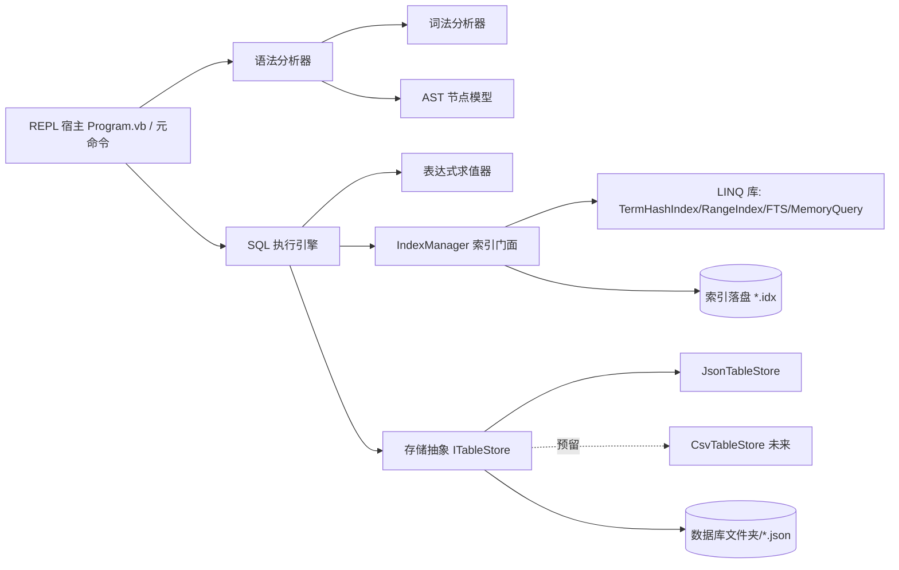

## 产品概述

在 `g:\JSql\src\JSql\JSql.vbproj`（VB.NET，net10.0 控制台项目）中实现一个实验性质的 SQL 引擎：以文件系统为数据库存储（一个文件夹 = 一个数据库，文件夹内的 JSON 文件 = 数据表），提供命令行 REPL 守护进程，用户可交互执行 SQL 语句。

## 核心功能

- **SQL 解释器**：实现兼容 MySQL 语法子集的完整解释器，覆盖 `SELECT / INSERT / DELETE / UPDATE / CREATE / DROP` 六类操作；不实现自定义函数、存储过程、事务、外键等高级特性
- SELECT 支持：投影列/别名/`*`、`WHERE` 复合条件（AND/OR/NOT、比较、LIKE、IN、BETWEEN、IS NULL）、`ORDER BY`、`GROUP BY` + 聚合函数（COUNT/SUM/AVG/MIN/MAX）、`HAVING`、`LIMIT/OFFSET`、`DISTINCT`、表别名、（INNER）JOIN
- CREATE 支持：`CREATE TABLE`（列定义与类型）、`CREATE INDEX`
- DROP 支持：`DROP TABLE`、`DROP INDEX`
- **命令行 REPL**：控制台守护进程，启动参数指定数据库根目录，REPL 内支持 `USE <db>` 切换数据库、`SHOW DATABASES/TABLES/INDEXES` 等元命令，查询结果以表格形式输出，逐条语句执行并回显受影响行数
- **索引技术**：复用 `G:\GCModeller\src\runtime\Darwinism\src\data\LINQ\LINQ\LINQ.vbproj` 中 `Runtime\Indexing`（TermHashIndex、RangeIndex、FTS、Levenshtein 等）与 `MemoryQuery`（MemoryIndex/MemoryTable/Query）的索引算法，用 WHERE 条件加速查询；发现索引算法 bug 时直接修正该 LINQ 项目
- **索引落盘**：索引数据持久化为伴随文件（如 `<table>.<column>.<indextype>.idx`），表数据变更时同步维护索引，重启后可加载
- **存储格式可扩展**：存储层通过抽象接口隔离文件格式，当前实现 JSON 存储，为后续 CSV 表存储预留扩展点

## 技术栈

- 语言/运行时：VB.NET，.NET 10（复用 `JSql.vbproj` 现有配置与三个既有 ProjectReference：`LINQ.vbproj`、`dataframework-netcore5.vbproj`、`Core.vbproj`，无需新增外部依赖）
- JSON 序列化：优先复用 sciBASIC Core 中现有 JSON 扩展/`DataFrame`（与 `MemoryTable` 的 `DataFrameResolver` 天然衔接），不足处用 `System.Text.Json` 兜底
- 构建工具：dotnet CLI（PowerShell）

## 实现方案

### 架构分层（自底向上）



### 关键技术决策

1. **SQL 前端**：手写词法分析器 + 递归下降语法分析器，产出强类型 AST；不引入第三方解析器生成器（保持 VB.NET 项目零新依赖、语法控制精确、便于兼容 MySQL 方言细节如反引号标识符、`LIMIT n OFFSET m`）。
2. **执行引擎**：单进程内顺序执行；SELECT 按存储层载入的行集合（`List(Of Dictionary(Of String, Object))`）做流式处理，WHERE 前先经 IndexManager 探测可用索引缩小候选行集（索引命中→候选集，否则全表扫描），再执行表达式求值过滤。
3. **索引复用**：为 JSON 行集合实现一个继承 `MemoryIndex` 的适配器（对齐 `MemoryTable` 的 `GetData(Of T)/CheckScalar` 模式），等值条件走 `TermHashIndex`、范围条件走 `RangeIndex(Of Integer/Double/Date)`、LIKE 走 FTS/Levenshtein；索引以伴随文件落盘并带版本号与表数据校验信息，过期自动重建。
4. **存储抽象**：定义 `ITableStore`（读全部行/写全部行/是否存在），JSON 为首个实现；表 schema（列名、类型）存于表文件自身或 `.<table>.meta` 元数据文件，隔离未来 CSV 差异。
5. **bug 修正授权**：测试索引时若发现 LINQ 库缺陷（如 `MemoryTable.GetData` 的 `CObj` 转换、RangeIndex 边界等），直接修改对应 `*.vb` 文件并保持既有 API 兼容。
6. **性能考量**：全表扫描 O(n)，等值索引命中 O(1)，范围索引命中 O(log n + k)；JSON 整表读写（小表场景可接受），写操作采用"内存修改 + 原子写回临时文件再替换"防止文件损坏；REPL 单连接无并发写竞争问题。

## 目录结构

```
g:\JSql\src\JSql\
├── JSql.vbproj                      # [MODIFY] 现有引用已足够；如需可整理 ItemGroup，保持 net10.0/Exe
├── Program.vb                       # [MODIFY] REPL 宿主：命令行参数解析、REPL 主循环、USE/SHOW/QUIT 元命令、结果表格化输出
├── Sql/
│   ├── Tokenizer.vb                 # [NEW] 词法分析器：关键字、标识符（含反引号）、数字/字符串字面量、运算符、分号
│   ├── SqlParser.vb                 # [NEW] 递归下降语法分析器：解析六类语句为 AST，MySQL 兼容子集
│   ├── Ast.vb                       # [NEW] AST 节点：SelectStmt/InsertStmt/UpdateStmt/DeleteStmt/CreateTableStmt/CreateIndexStmt/DropStmt/表达式节点
│   └── SqlError.vb                  # [NEW] SQL 语法/执行异常与错误位置信息
├── Engine/
│   ├── SqlEngine.vb                 # [NEW] 执行引擎门面：接收 SQL 文本→解析→执行→返回 ResultSet/受影响行数
│   ├── Executor.vb                  # [NEW] 各语句执行器：SELECT（含 JOIN/GROUP/ORDER/LIMIT）、DML、DDL
│   ├── ExpressionEvaluator.vb       # [NEW] WHERE/ON/HAVING 表达式求值、聚合函数计算
│   └── ResultSet.vb                 # [NEW] 查询结果模型（列头+行数据+影响行数）
├── Storage/
│   ├── ITableStore.vb               # [NEW] 存储抽象接口（含工厂按扩展名分发，为 CSV 预留）
│   ├── JsonTableStore.vb            # [NEW] JSON 表存储：文件夹=库、*.json=表，schema 元数据，原子写回
│   └── DatabaseCatalog.vb           # [NEW] 数据库/表目录管理：SHOW 元命令数据来源、USE 切换、CREATE/DROP 落地
├── Indexing/
│   ├── IndexManager.vb              # [NEW] 索引门面：按列建/删索引、WHERE 条件索引探测、写操作后索引维护
│   ├── JsonMemoryIndex.vb           # [NEW] 继承 LINQ MemoryIndex 的 JSON 行集合适配器（对齐 GetData/CheckScalar 模式）
│   └── IndexPersistence.vb          # [NEW] 索引落盘/加载：*.idx 伴随文件、版本与失效校验
└── G:\GCModeller\src\runtime\Darwinism\src\data\LINQ\LINQ\
    └── Runtime\Indexing\*.vb        # [MODIFY·按需] 测试中发现 bug 时修正索引算法（保持 API 兼容）
```

## Agent Extensions

### SubAgent

- **code-explorer**
- Purpose：实施前深入探查 `G:\GCModeller\src\runtime\Darwinism\src\data\LINQ\LINQ` 项目中 `MemoryQuery\` 与 `Runtime\Indexing\` 的完整 API 面（MemoryIndex/MemoryQuery/Query/TermHashIndex/RangeIndex/FTS/InMemoryDocuments 工厂），梳理可复用点与潜在 bug 清单，避免实现时凭空猜测 API 签名
- Expected outcome：产出索引库 API 清单、适配器需要实现的抽象方法、已知 bug/风险点列表，直接指导 JsonMemoryIndex 与 IndexManager 的编写