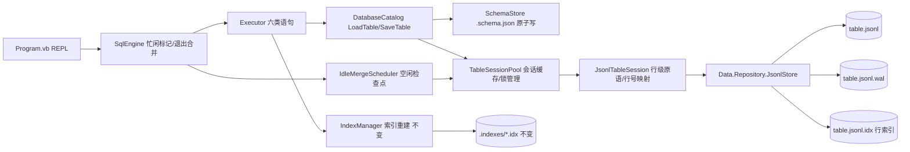

## 产品概述

将 JSql 的数据表存储从"单个 JSON 文件（schema + 全部行数据一体、整表重写）"改造为"**schema 与数据分离 + JSONL 行式存储 + WAL 日志**"，直接复用底层 `Data.Repository.JsonlStore` 引擎，以显著提升写入性能，并在系统空闲时周期性把 WAL 合并（checkpoint）回数据文件。

## 核心功能

- **存储格式分层**：每张表拆分为两个文件——`<table>.schema.json`（表结构：列定义、注释、表级键）与 `<table>.jsonl`（数据，一行一条 JSON 记录，行号即行序号）
- **WAL 写入路径**：所有写操作（`INSERT`/`UPDATE`/`DELETE`）只写入内存挂起层 + WAL 日志（带 fsync），不再整表重写；`INSERT` 批量追加一次日志记录 + 一次 fsync
- **读取一致性**：读取时自动叠加挂起修改，写入后立即查询即可看到最新数据（读己之写）
- **空闲合并**：后台调度器在无语句执行时周期性调用 `Merge()`，把 WAL 合并回数据文件并清空日志；退出时执行最后一次合并
- **状态可观测**：`SHOW STORAGE [FROM t]` 查看单表/全库的存储状态（数据文件、行数、挂起操作数、WAL 大小、合并需求）；`CHECKPOINT [TABLE t]` 手动触发合并
- **启动可配置**：命令行开关控制合并间隔、fsync 策略、诊断输出与旧格式兼容模式
- **向后兼容与迁移**：旧的 `<table>.json` 仍可读取，首次写入时自动迁移为新的双文件布局，旧文件保留为备份；删除表时清理全部伴生文件（`.jsonl/.schema.json/.wal/.idx/.lock/.bak/.merge.tmp`）

## 边界与约束

- 不在本次改造范围内：SQL 语法与语义、表达式求值、索引算法、REPL 交互形式均保持不变（含索引加速、`DESCRIBE`/`SHOW` 输出）
- 同一张表在单进程内只允许一个会话（JsonlStore 内部持有 `.lock` 独占锁），因此 DROP 表/库、退出前必须先释放会话
- 写入持久性分级：默认每条写操作 fsync 日志（断电级安全）；可用开关关闭以获得更高吞吐（仅防进程崩溃）

## 技术栈

- 语言/运行时：VB.NET，.NET 10（沿用现有 `src\JSql\JSql.vbproj`，无新增外部依赖）
- 存储引擎：`Microsoft.VisualBasic.Core` 项目的 `Data.Repository.JsonlStore`（`Core.vbproj` 已在项目引用中，仅需 `Imports Data.Repository`）
- 序列化：沿用 `System.Text.Json`（行记录序列化 + `ConvertJsonElement` 解包 JsonElement → Long/Double/String/Boolean/Nothing）
- 并发/调度：`System.Threading.Timer` + `SyncLock`（与 JsonlStore 自身的 `_gate` 模型一致）

## 实现方案

### 顶层策略

把"整表读写"重构为"**schema 独立落盘 + 行级会话（session）**"两层：`DatabaseCatalog` 对外仍提供 `LoadTable/SaveTable`（`StoredTable` = Schema + Rows），内部改为「Schema 由 `SchemaStore` 读写；行数据由 `JsonlTableSession` 提供」。`SaveTable` 内部对内存行与 JsonlStore 虚拟视图做**行级差异同步**（追加/原位替换/区间删除），从而在**不改动 Executor 写路径**的前提下把 IO 从"整文件重写 O(文件大小)"降为"仅变更行的日志追加 O(变更量)"。

### 关键设计决策

1. **文件布局**：`<db>\<table>.schema.json` + `<db>\<table>.jsonl`（JsonlStore 伴生 `*.wal/*.idx/*.lock/*.bak/*.merge.tmp`）。schema 文件独立原子写（临时文件 + 替换），与 JsonlStore 的崩溃安全机制互不干扰
2. **行号映射**：JsonlStore 行号 1 基，内存行偏移 0 基，统一由会话封装（`lineNumber = offset + 1`）；索引层（0 基偏移）与表达式层无需感知
3. **写原语选择**（性能关键）：

- INSERT → 新增行连续位于尾部，走 `AppendLines`（一次日志记录 + 一次 fsync，批量最优）
- UPDATE → 对每个改动行 `ReplaceLine(offset+1, json)`
- DELETE → 把删除偏移排序后**合并为连续区间**，逐区间 `ReplaceLines(start, count, Nothing)`；分散删除时**从大到小**逐行 `DeleteLine`（避免行号前移导致错位）

4. **会话生命周期**：`TableSessionPool` 按 `(db, table)` 唯一持有会话；`DROP TABLE`/`DROP DATABASE`/进程退出前必须 `Dispose`（释放 `.lock`、并在退出时先 `Merge()`）；会话缓存不设 LRU 淘汰（表数量少），仅按需打开
5. **空闲合并调度**：`IdleMergeScheduler`（`Timer`，间隔可配，默认 30s）在"当前无语句在执行"时遍历打开的会话，对 `HasPendingChanges` 的会话调用 `Merge()`；采用"忙/闲"计数器由 `SqlEngine.Execute` 前后标记，避免与读枚举并发（`Merge()` 在存在未完成 `ReadLines()` 枚举时会抛异常，因此所有读取必须 `.ToList()` 物化）
6. **索引联动**：索引构建仍基于内存行集合（现状不变），写操作后继续走 `RebuildAfterWrite` 显式失效；由于不再整表重写，索引存档（`.indexes\*.idx`）逻辑无需改动
7. **旧格式迁移**：`DatabaseCatalog` 定位表文件时优先 `<table>.jsonl`，其次兼容 `<table>.json`；若仅有旧文件，`LoadTable` 用 `JsonTableStore.Read` 读入，首次 `SaveTable` 时写出新双文件并把旧文件重命名为 `<table>.json.bak`
8. **表发现修正**：`GetTables`/`FindTableFile` 必须排除 `<table>.schema.json`（否则会被识别成名为 `t.schema` 的表）以及 `.wal/.idx/.lock/.bak/.tmp` 等伴生文件

### 性能与可靠性

- 写入：从 O(文件字节数) 全量重写降为 O(变更行字节数) 顺序追加；批量 INSERT 每条记录一次 fsync
- 读取：`ReadLines()` 单遍流式（不整文件载入），叠加内存片段表；内存行集合仍为 `List(Of Dictionary(Of String,Object))`，与现有执行器/索引层完全兼容
- 合并：追加型布局走 JsonlStore 快路径（只写新增字节）；空闲时执行，避免与用户语句争抢 IO；合并崩溃安全由 JsonlStore 的 `mb/mbf/md` 标记 + `.bak` 保证
- 可靠性边界：默认 `FsyncEachWrite=True`；关闭后仅防进程崩溃（断电可能丢失最近写入），并在 `SHOW STORAGE` 中明示

### 架构



## 实现注意事项

- **必须物化读取**：所有 `ReadLines()`/`ReadLines(start,count)` 调用一律 `.ToList()`，否则 `Merge()` 会因 `_activeReaders > 0` 抛异常
- **锁的释放顺序**：`DROP TABLE`/`DROP DATABASE` 前先 `Pool.Close(db, table)`，再删文件；否则被 `.lock` 占用导致删除失败
- **行号基准差异**：会话内统一 1 基，跨层（索引/执行器）保持 0 基，转换只在一处发生并加注释
- **空值/类型往返**：行值可能是 `Long/Double/String/Boolean/Nothing`，序列化后按 `ConvertJsonElement` 解包，保持整数不被写成浮点
- **兼容性**：`SHOW TABLES`、`DESCRIBE`、`SHOW INDEXES` 输出格式不得变化；旧的 `<table>.json` 表在迁移前行为与现在完全一致
- **降级开关**：提供 `--legacy-json` 以旧整表存储运行，便于对比与回退；默认走新存储
- **诊断不刷屏**：JsonlStore 的 `Info` 事件（索引重建、撕裂修复、崩溃恢复）仅在 `--verbose` 时打印，避免污染 REPL 输出
- **文档同步**：改动存储布局后同步更新根目录 `README.md` 的"数据是怎么存的"与限制说明

## 目录结构

```
g:\JSql\
├── README.md                         # [MODIFY] 存储布局（.schema.json/.jsonl/WAL/伴生文件）、CHECKPOINT 与 SHOW STORAGE、CLI 开关、迁移说明
└── src\JSql\
    ├── Program.vb                    # [MODIFY] 新增 CLI 开关解析(--merge-interval/--no-fsync/--verbose/--legacy-json)、help 文本、退出时 MergeAll 输出
    ├── Engine\
    │   ├── SqlEngine.vb              # [MODIFY] 持有 TableSessionPool/IdleMergeScheduler/StorageOptions；Execute 前后忙闲标记；Dispose 合并
    │   ├── Executor.vb               # [MODIFY] 新增 CHECKPOINT 与 SHOW STORAGE 的执行分支（六类语句路径保持）
    │   └── ResultSet.vb              # [KEEP]
    ├── Sql\
    │   ├── Ast.vb                    # [MODIFY] ShowKind.Storage 新枚举值；新增 CheckpointStatement
    │   └── SqlParser.vb              # [MODIFY] 解析 SHOW STORAGE [FROM t]、CHECKPOINT [TABLE t]
    └── Storage\
        ├── StorageOptions.vb         # [NEW] 存储开关：MergeIntervalSeconds/FsyncEachWrite/Verbose/LegacyJson；从命令行参数构造
        ├── StorageLayout.vb          # [NEW] 文件命名与伴生文件约定：SchemaPath/DataPath/IsSchemaFile/IsCompanionFile/EnumerateCompanions
        ├── SchemaStore.vb            # [NEW] `<table>.schema.json` 读写（复用 JsonColumn/JsonKey DTO 与原子写；缺文件时从旧 .json 迁移）
        ├── JsonlTableSession.vb      # [NEW] 单表会话：JsonlStore 封装、行<->JSON 序列化、行级同步(SyncRows 差异算法)、状态查询、Merge、Info 转发
        ├── TableSessionPool.vb       # [NEW] 按 (db,table) 缓存会话，Close/CloseDatabase/MergeAll/DisposeAll，管理独占锁
        ├── IdleMergeScheduler.vb     # [NEW] 后台 Timer：空闲时对挂起会话执行 Merge；Start/Stop/Pause，与语句执行互斥
        ├── DatabaseCatalog.vb        # [MODIFY] 表发现排除伴生文件与 .schema.json；LoadTable/SaveTable/DeleteTable 走新布局；旧 .json 迁移；提供 SHOW STORAGE 所需状态
        ├── ITableStore.vb            # [MODIFY] 保留旧整表接口与 SqlTypes/模型；新增 ITableSession 抽象与 StoredTable 的行级辅助（NewRow 已有）
        └── JsonTableStore.vb         # [KEEP] 旧 `.json` 整表存储，仅作为迁移期读取源与 --legacy-json 实现
```

## 关键代码结构

```
Namespace Storage

    ''' <summary>单表存储会话：schema 与行数据分离 + WAL 行级写入</summary>
    Public Interface ITableSession : Inherits IDisposable
        ReadOnly Property Schema As TableSchema
        ReadOnly Property DataFilePath As String     ' <table>.jsonl
        ReadOnly Property LogFilePath As String      ' <table>.jsonl.wal
        ReadOnly Property LineCount As Long          ' 当前虚拟行数
        ReadOnly Property PendingOperations As Long  ' 未合并的 WAL 操作数
        ReadOnly Property HasPendingChanges As Boolean

        ''' <summary>物化读取全部行（已叠加挂起修改），行序即 1 基行号</summary>
        Function ReadRows() As List(Of Dictionary(Of String, Object))

        ''' <summary>把内存行集合与当前存储做行级差异同步：尾部追加/原位替换/连续区间删除</summary>
        Sub SyncRows(rows As List(Of Dictionary(Of String, Object)))

        ''' <summary>把挂起修改合并回数据文件并清空 WAL</summary>
        Sub Merge()

        Event Info(message As String)
    End Interface
End Namespace
```

## Agent Extensions

### SubAgent

- **code-explorer**
- Purpose：在动手改造前，用其复核 `JsonlStore`/`WAL` 的边界行为（`Merge()` 与活动读枚举的互斥条件、`RepairTornTail` 对末行的处理、`FsyncEachWrite` 的语义、伴生文件清单）以及 JSql 侧 `LoadTable/SaveTable` 的全部调用点与 `IndexManager` 失效判定逻辑，确保会话封装与索引联动无遗漏
- Expected outcome：输出一份"待接入点 + 边界行为"清单（含文件路径与行号引用），直接指导 `JsonlTableSession`、`TableSessionPool`、`DatabaseCatalog` 的编写，避免凭空假设 API 行为